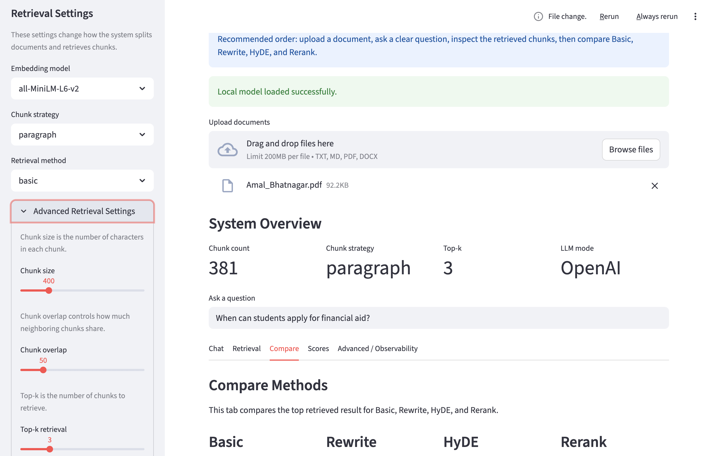

# RAG Lab App (Hybrid: Local + OpenAI + Claude)

This version supports:

- Local GGUF model
- OpenAI API
- Claude API
- Retrieval-only mode



## Files

- `app.py`
- `requirements.txt`
- `README.md`

## Install

```bash
python -m pip install -r requirements.txt
```

## Run on DataHub / JupyterHub

```bash
python -m streamlit run app.py --server.port 8501 --server.address 0.0.0.0
```
If port `8501` is already in use, try:

```bash
python -m streamlit run app.py --server.port 8502 --server.address 0.0.0.0
```

Then open:

```text
https://<your-jupyter-host>/user/<your-username>/proxy/port/
```

For example, the URL pattern is:

```text
https://gpu-demo.cloudbank.2i2c.cloud/user/choise928/proxy/8501/
```

## Run locally

```bash
python -m streamlit run app.py --server.port 8502
```

## Local model path

The app tries the DataHub path first:

```text
/home/jovyan/shared/qwen2-1_5b-instruct-q4_0.gguf
```

Then it tries common local paths in `~/Downloads/`.

You can always change the model path in the sidebar.

## Models used in the app

### OpenAI
- `gpt-5.4`
- `gpt-5-mini`

### Anthropic
- `claude-opus-4-6`
- `claude-haiku-4-5`

## Notes

- Retrieval works even if generation does not.
- Set `LLM mode` to `None` if you want retrieval only.
- This app supports:
  - Basic
  - Rewrite
  - HyDE
  - Rerank
  - Chat / Retrieval / Compare / Scores / Advanced tabs

## Create a `.env` file

Create a file named `.env` in the same folder as `app.py`.

Example:

```text
OPENAI_API_KEY=your_openai_key_here
ANTHROPIC_API_KEY=your_anthropic_key_here
```

Do not commit the `.env` file to Git.

## Troubleshooting

### Local model does not load
Check whether the file exists:

```bash
ls -lh /home/jovyan/shared/qwen2-1_5b-instruct-q4_0.gguf
```

If the file does not exist, retrieval still works. Only local generation will fail.

### Streamlit does not open in DataHub
Make sure you keep the terminal running and open the Jupyter proxy URL instead of the raw localhost URL.

### Port 8502 is already in use
Try another port:

```bash
python -m streamlit run app.py --server.port 8503 --server.address 0.0.0.0
```

Then open `/proxy/8503/`.
